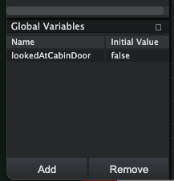
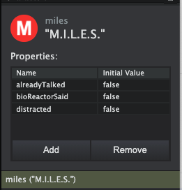

# Dialogs

ALPACA uses the node-based dialog editor [Schnack](https://pac4.gitlab.io/schnack-website/). It supports multiple languages, lua scripting and simple voice-overs. ALPACA expects dialogs in the `dialog` folder like `data-src/dialog/dialogs.schnack`. Voice files must be stored in `data-src/audio/voice` and follow the naming convention `<language>_<dialog_id>.ogg`. Example: `de_001.ogg` for the German dialog with id 1.

Examples for start dialogs:

```lua
-- Dialog without callback
PlayDialog("armchair")
```

```lua
-- Dialog with callback.
-- The second function is called after the dialog has been played.
function takeBananaDialog()
    PlayDialog("banana", function ()
        PlayAudio("pick-up-item.ogg")
        AddToInventory()
        SetSkin("inventory")
        SetHidden()
    end)
end
```

## Lua integration

### Global Variables

[Schnack](https://pac4.gitlab.io/schnack-website/) can define **Global Variables**. These variables are stored in the global namespace.



```lua
-- Check global variable
if lookedAtCabinDoor then
    print("I'm looking at the cabin door.")
end
```

### Character Properties

Each character can have **Properties** which are stored in characters.character_name.property.



```lua
-- Check character property
if characters.miles.alreadyTalked then
    print("Miles has already talked to.")
end
```
