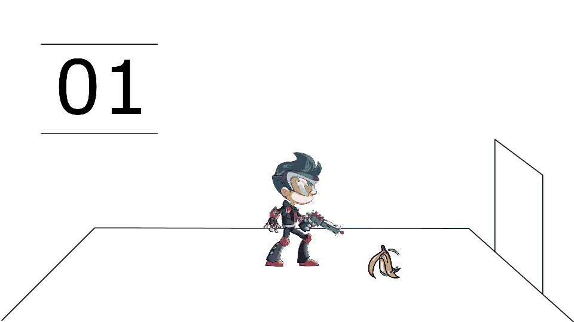
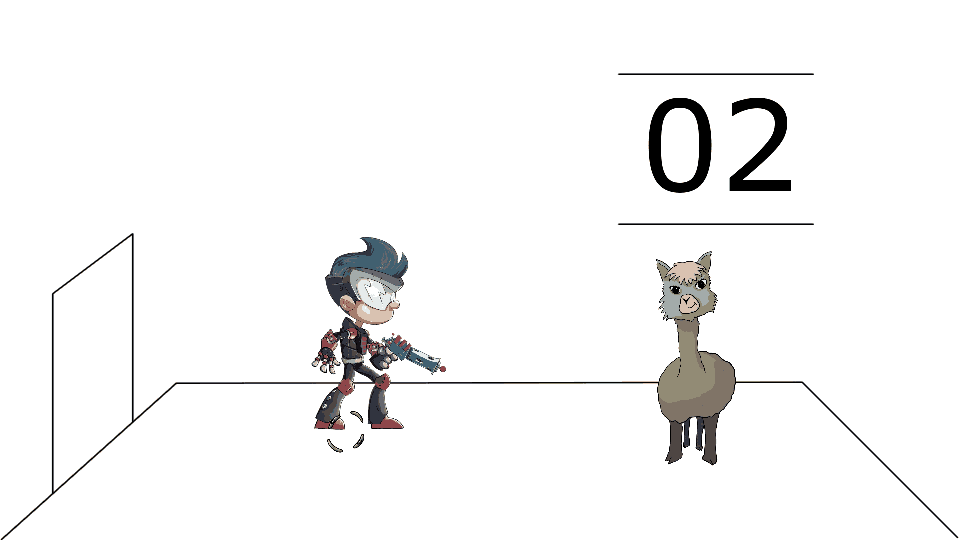

# Getting started with your first ALPACA game

[ALPACA on GitHub](https://github.com/pinguin999/ALPACA)

[ALPACA on Discord](https://discord.gg/zWdnq6UJ79)

When you want to use ALPACA, you have two different options:

1. You can use ALPACA for game development without the need to compile C++ code,
   only using Lua scripting and the Spine editor (Windows only)
2. You can set up ALPACA for engine development, where you compile the engine (C++ code)
   yourself and are able to make changes to the core functionality of ALPACA
   (this is required on Mac and Linux, but also possible on Windows)

## Setup your PC for game development (Windows)

This is the easiest way to work with ALPACA. You won't have to mess with C++ compilers
and will use a pre-compiled version of ALPACA. Unfortunately, this only works on Windows.

1. Get [ALPACA for Windows](https://alpaca-engine.de/alpaca_engine.zip).
2. Install [Spine](https://esotericsoftware.com/) into the default folder.
3. Start `prepare_assets.exe` so your changes in the data-src folder will be synced into the data folder.
4. With `pac.exe` you can start the game.
5. In the Schnack folder you can find the dialog editor.
6. For Lua Scripting it's recommand to use [VS Code](https://code.visualstudio.com/) with a Lua extension like [LuaHelper](https://marketplace.visualstudio.com/items?itemName=yinfei.luahelper).
7. [Start building your game.](#lets-start-your-own-game)
8. If you need help setting up your first project or want to talk about your game.
Book a time slot with the developers of ALPACA at [calendly](https://calendly.com/pinguin999/pac-indie-game-development) 🇩🇪🇬🇧, mail me at [kolja@portaldogs.com](mailto:kolja@portaldogs.com) 🇩🇪🇬🇧 or join [ALPACA on Discord](https://discord.gg/zWdnq6UJ79)

## Setup your PC for engine development (Windows / Mac / Linux)

This is the advanced way to work with ALPACA. You will compile the engine yourself.
This will also enable you to make changes to the engine core, if you feel this is
necessary for your use-case.

1. Clone the ALPACA repository with git via `git clone --recurse https://github.com/pinguin999/ALPACA.git` or clone it with the GutHub Desktop client.
2. Setup your Mac or Linux for [JNGL development](https://github.com/jhasse/jngl). Or [Windows development](https://github.com/jhasse/jngl-starter)
3. Now you should be able to play the demo project.
4. Check that you have installed [Spine](http://de.esotericsoftware.com/), [Rhubarb](https://github.com/DanielSWolf/rhubarb-lip-sync/releases), [Lua](https://github.com/rjpcomputing/luaforwindows) and [Python](https://www.python.org/downloads/). Now you can re-export all assets from data-src to data with the prepare_assets.py script. **On Windows you need [Spine](http://de.esotericsoftware.com/) installed and you can use prepare_assets.exe to export the assets.**
5. If you need help setting up your first project or want to talk about your game.
Book a time slot with the developers of ALPACA at [calendly](https://calendly.com/pinguin999/pac-indie-game-development) 🇩🇪🇬🇧, mail me at [kolja@portaldogs.com](mailto:kolja@portaldogs.com) 🇩🇪🇬🇧 or join [ALPACA on Discord](https://discord.gg/zWdnq6UJ79)

## What's in the demo game?

The demo has two scenes. In the first scene is a banana and it has a funny effect if you click it.

In the second scene is alpaca so you have something for your experiments there. If you press on alpacas head it's talking to you.


### What you can learn from the demo game

The demo is a good starting point for a new project. It has already a working setup and
some good defaults set up for you. You can also start with an empty data-src folder, but for a
smooth start it's recommanded to start from the demo game.

You can play and learn from the project. Here are some tasks you can try out yourself.

**All game content is in the `data-src` folder and the `prepare_assets` converts it and puts it into the `data` folder. So never change any files in the `data` folder. It should always be safe to delete the `data` folder and `prepare_assets` will recreate everything from `data-src`.**

#### Add a Spine object

All items in an ALPACA game are Spine objects. So to add an new item to a scene you have to start a new Spine project.

1. Create a folder in `data-src` with the name of your object. Let's name it `dog`
2. Open Spine and click `New Project`
3. Name the skeleton also like your folder. In our case it's `dog` again
4. Add images to your spine file and create nice animations.
5. Save the Spine file in `data-src/dog/dog.spine`
6. The `prepare_assets` script should already running, if not start it. Check the output for `...dog.spine has been modified`
7. Now open `data-src/scenes/test_chamber_one.json` in VS Code and add the dog item into the items list.

```josn
{
    "items": [
        {
            "spine": "banana",
            "x": "330.0",
            "y": "400.0",
            "scale": "0.3",
            "skin": "normal"
        },
        {
            "spine": "dog",
            "x": "0.0",
            "y": "0.0"
        }
    ],
...
}
```

More about [scene objects](scene.md) and [Spine](spine.md)

8. The Scene should now reload and show the dog.

#### Move an object

The dog object you just created will be positioned in the center of the screen.

1. In the game open the edit mode by pressing <kbd>Tab</kbd>
2. A green circle will shown under the dog

3. Drag and drop the dog whereever you want to have the dog.
4. Press <kbd>S</kbd> to save.

#### Play with the scripts

Interactable regions are defined via a `Bounding Box` in Spine.

1. Select a `bone` in Spine and select `Bounding Box` from the new dropdown.
2. Give the box a speaking name. The name should represent the action. Let's name it `bark`
3. The prepare_assets script will automaticly generate a file called `bark.lua` for you. The file will contain this line

```lua
print("bark")
```

4. The dog will automaticly be reloaded the clickable area can be clicked.
5. If you are not sure where the area is you can visulise it by pressing <kbd>F10</kbd>
6. After clicking the area the debug console will show the text `bark`
7. If your dog has a bark animation you can start the animation via the script by aclling the [PlayAnimation](https://alpaca-engine.de/lua/#PlayAnimation) function.

```lua
print("bark")
PlayAnimation(0, "bark", false, pass)
```

Now we will start with the **Lua scripting**, the way logic is defined in an ALPACA game. A full list of functions can be found in the [Lua API](lua.md) documentation. For the quick intro you want the player to go to the item and interact with it. To be able to go somewhere you have to define a [Point](http://esotericsoftware.com/spine-points) in Spine, so let's add the Point to our item and save it again. *I have named the Point in the example "game center" and will also use this name in this tutorial's script*.

Most Lua Function like `GoToPoint` have two versions: GoToPoint and GoToPointOn

```lua
print("banana_clicked")

function respawn()
    print("respawn")
    PlayAnimationOn("Player", 0, "idle", true, pass)
end

function play_death()
    PlayAnimationOn("Player", 0, "death", false, respawn)
end

GoToPointOn("banana", "center", play_death)
```

For a full overview about all Lua functions see the [Lua documentation](lua.md)

#### Change Dialog and play audio

ALPACA comes with the [Schnack](https://pac4.gitlab.io/schnack-website/) node based dialog editor. The alpaca in the demo has one dialog. You can start Schnack and open the dialog file from `data-src/dialog/dialogs.schnack`

#### Change the game config

First you should look into the **data-src/config/game.json** file. There you can change all important base parameters like the game name and the **start_scene**.

#### Add a new scene

Everything in an ALPACA project is organized in **scenes**. A scene exists out of a background, some items placed in the scene and music that will be played in the background. So let's look into the  **scenes** folder. There you have the two example scenes. Let's copy one of the example scene files and rename it to what you set **start_scene** to in **game.json**. If you do not need the test_chambers it's safe to delete them.

In ALPACA everything you can see on the screen is a Spine project, so for the **scene background** you need to create a Spine project. Open Spine and click *New Project* and name the [skeleton](http://esotericsoftware.com/spine-skeletons#Skeletons) to your scene name. The background is drawn from the center so the Spine 0,0 point should be in the middle of the screen. If you want the player to walk in the scene you need a `walkable_area` [bounding box](http://esotericsoftware.com/spine-bounding-boxes). For reference you can check out **data-src/scene1/scene1.spine**. After saving our scene background you should update the background entry in our scene file. If it's not already running you should start **prepare_assets.py** to get the files exported into the data folder. If you start your game now you should see your new scene.
