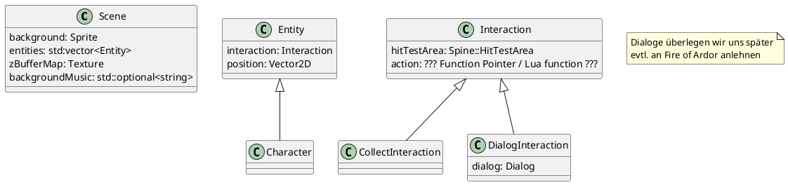

 <!-- CTRL+K V drücken für Preview, evtl muss graphviz installiert werden -->

# Aufbau

## Szenen

Eine Szene hat ein **Hintergrundbild**, **Entities**,
die auf diesem Hintergrund gezeichnet werden und ggf.
interaktiv sein können und einen begehbaren Bereich
in Form des aus Blender gerenderten **Z-Buffers**,
der auch gleich bestimmt, wie groß oder klein die
Charaktere / Gegenstände sind (Perspektive).

Zusätzlich kann eine Szene eine Hintergrundmelodie haben.

## Entities

Entities können entweder nur als Kulisse dienen, oder
interaktiv sein. Interaktive Objekte haben ein
Hit-Test-Polygon (dafür benutzen wir Spine).
Bei Interaktion kann eine Aktion ausgeführt werden.
Eine Aktion kann z.B. sein, den Gegenstand aufzunehmen
(ins Inventar).

## Charactere

Charaktere sind spezielle Entities, die bei Interaktion
einen Dialog ausführen.
Als spezialfall könnte man auch Charaktere einsammeln(Roboter, sprechendes Haustier, etc.)

## Inventar

Das Inventar enthält aufsammelbare Entities.

## Dialoge

- Knoten
  - Text (ein Nachfolge-Knoten)
  - Auswahlmöglichkeiten (mehrere Kind-Knoten)

- Neues Spine Projekt erstellen
- Skeleton umbenennen
- Speichern mit dem gleichen Name wie Skeleton
- Bilder in den Ordner packen
- Idle Animation definieren
- BB Boxen erstellen
